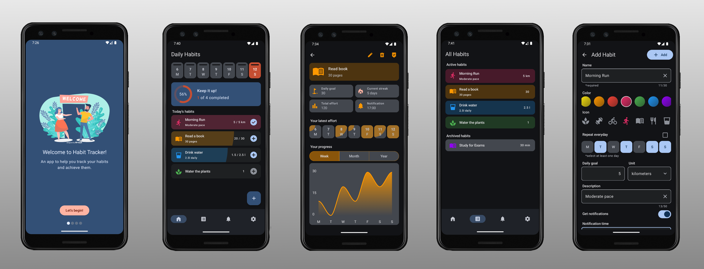

# Habit-Tracker
A lightweight habit tracker app that helps users track their habits and notifies them about upcoming goals.
## Status
The application is currently under development, but its key features are fully functional.
## Features:
### Implemented:
- User onboarding
- Habit tracking
- Adding, editing, and deleting habits
- Archiving habits
- Setting daily effort states
- Daily statistics
- Progress charts
- All habit list
- Application settings
- Light and dark mode
- Material3 components
### In progress:
- Notifications
- Unit tests
### Upcoming:
- Chart fixes

## Details
### Architecture
- Implements the **MVVM** pattern
- **Multimodule clean architecture**, consisting of the following modules:
  - app: The main Android application module, serving as the controller for all other modules. Responsible for configuration, navigation, and overall orchestration.
  - base: Provides basic implementations for ViewModel, UiState, UseCase, Result, and other foundational elements.
  - common:
    - ui: Contains strings, icons, and commonly used UI composables.
    - utils: A utility module for shared helper functions and tools.
  - component: The main module for components. Handles domain and data logic specific to business requirements.
  - feature: Dedicated modules for features. Focuses on the UI layer of the application.
  - source: Modules for data sources, such as databases or caches.
### Technologies
- Fully written in **Jetpack Compose**
- Room Database
- ViewModel
- Kotlin Flow
- Kotlin Coroutines
  
